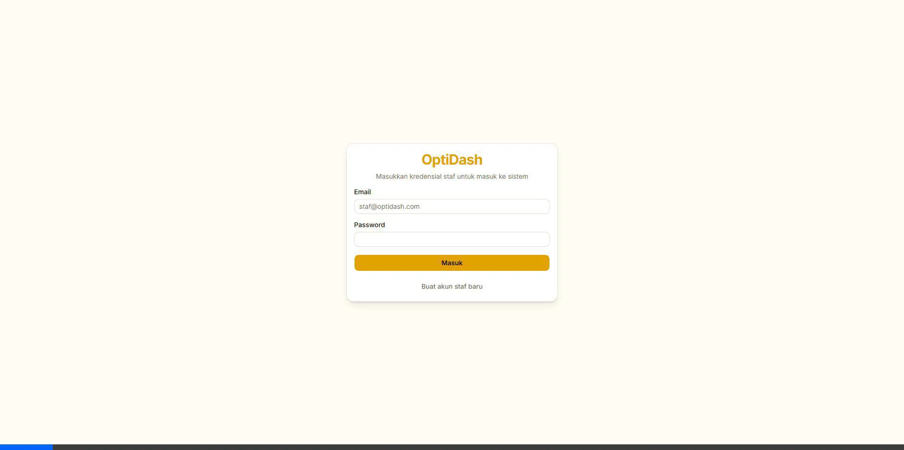

# OptiDash — Optical Shop Management System

OptiDash adalah aplikasi manajemen toko optik modern yang mengintegrasikan kasir (Point of Sale), manajemen inventaris produk kacamata, database pelanggan, rekam resep kacamata, serta sistem pelaporan penjualan bulanan. Aplikasi ini didesain dengan antarmuka yang bersih, responsif, serta dioptimalkan khusus untuk kemudahan cetak laporan fisik (*hardcopy*).

---

## 📸 Cuplikan Antarmuka (Screenshots)

Berikut adalah tangkapan layar antarmuka OptiDash:

### 1. Halaman Autentikasi (Login)


*Catatan: Anda dapat mengambil tangkapan layar modul POS, Inventaris, dan Laporan secara mandiri di komputer lokal Anda dan menyimpannya ke dalam folder `public/screenshots/`.*

---

## 🚀 Fitur Utama

*   **Point of Sale (POS)**: Pemrosesan transaksi penjualan cepat terintegrasi pencarian SKU, manajemen diskon, penghitungan kembalian, dan nota digital.
*   **Rekam Medis Resep Kacamata**: Pencatatan riwayat resep kacamata pelanggan mencakup ukuran mata kanan/kiri (OD/OS: SPH, CYL, AXIS, ADD) dan jarak pupil (PD).
*   **Manajemen Inventaris**: CRUD stok Frame, Lensa, Softlens, dan Aksesoris disertai indikator peringatan otomatis untuk barang dengan stok kritis (di bawah 5 item).
*   **Laporan & Fitur Cetak**: Filter rekap penjualan bulanan/tahunan yang dilengkapi stylesheet `@media print` sehingga siap dicetak rapi di kertas A4 tanpa elemen UI browser.
*   **Autentikasi Aman**: Perlindungan halaman modul menggunakan Better Auth dengan sistem sesi terenkripsi untuk keamanan data staf toko.

---

## 🛠️ Tech Stack

*   **Core Framework**: Next.js 16 (App Router) & React 19
*   **Programming Language**: TypeScript
*   **Database & ORM**: SQLite (`sqlite.db`) dengan Drizzle ORM
*   **Authentication**: Better Auth (adapter Drizzle)
*   **Styling & UI Components**: Tailwind CSS, Shadcn UI, Base UI
*   **Developer Experience**: Turbopack & ESLint

---

## 💻 Cara Setup & Penggunaan Lokal

### Prasyarat
Pastikan Anda sudah menginstal **Node.js** (versi 18+) di komputer Anda.

### 1. Kloning Repositori
```bash
git clone https://github.com/username/optik-dash.git
cd optik-dash
```

### 2. Instalasi Dependensi
```bash
npm install
```

### 3. Konfigurasi Environment Variables
Salin berkas template `.env.example` menjadi `.env`:
```bash
cp .env.example .env
```
Buka file `.env` yang baru dibuat dan isi `BETTER_AUTH_SECRET` dengan string acak minimal 32 karakter (Anda dapat menggunakan perintah `npx better-auth secret` untuk membuatnya).

### 4. Sinkronisasi Database
Jalankan perintah sinkronisasi Drizzle kit untuk menginisialisasi skema tabel ke database lokal SQLite (`sqlite.db`):
```bash
npx drizzle-kit push
```

### 5. Menjalankan Server Pengembangan
Jalankan server lokal dalam mode pengembangan:
```bash
npm run dev
```
Buka browser Anda dan akses halaman [http://localhost:3000](http://localhost:3000).

### 6. Membangun Proyek untuk Produksi (Build)
Untuk memeriksa kelayakan deploy dan mengoptimalkan aset produksi, jalankan:
```bash
npm run build
```
Hasil kompilasi siap diposisikan ke server hosting melalui perintah `npm start`.

---

## 🔑 Akun Demo / Tester (Produksi)
Untuk menguji aplikasi versi live (setelah Anda men-deploy database), disarankan membuat satu pengguna uji coba di database Anda dengan kredensial berikut:
*   **Email**: `demo@optidash.com`
*   **Password**: `password123`

---

## 📂 Struktur Folder Singkat

```text
optik-dash/
├── docs/             # Dokumentasi proyek (PRD, Arsitektur, Progress Report)
├── public/           # Aset statis & ilustrasi (SVG, Favicon)
└── src/
    ├── app/          # Next.js App Router (Halaman Utama & API Routes)
    ├── components/   # Komponen UI Reusable (Shadcn & Layout Sidebar)
    └── lib/          # Logika Database (Drizzle), Skema, dan Autentikasi (Better Auth)
```

---

## 📄 Dokumentasi Tambahan
Informasi lebih lanjut tentang perancangan sistem dapat dibaca di folder `docs/`:
*   [Dokumentasi Arsitektur](docs/architecture.md)
*   [Product Requirements Document (PRD)](docs/prd.md)
*   [Laporan Progress Kemajuan Proyek](docs/progress_report.md)
