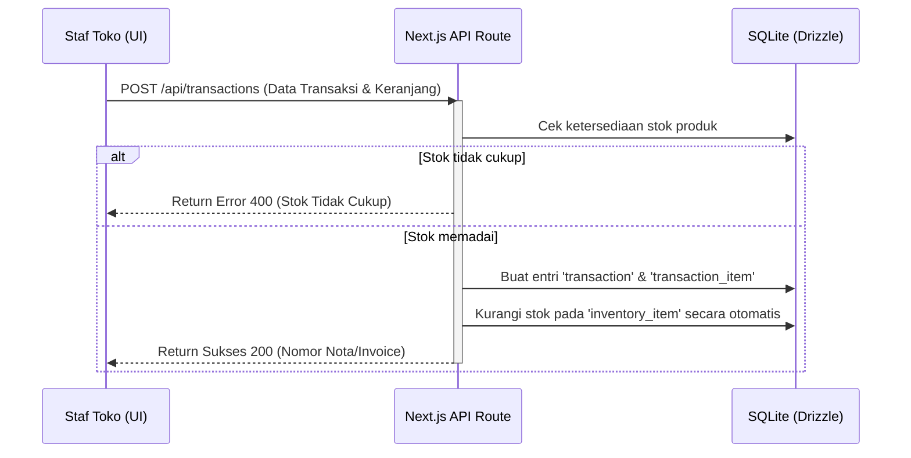

# Dokumentasi Arsitektur Sistem: OptiDash

OptiDash dibangun menggunakan arsitektur **Client-Server 3-Tier** yang terintegrasi penuh dalam satu framework **Next.js** menggunakan App Router. Database lokal berbasis relational menggunakan SQLite dikelola secara terstruktur melalui Drizzle ORM.

---

## 🏛️ Arsitektur Tingkat Tinggi

Sistem terbagi ke dalam tiga layer utama:

1.  **Presentation Layer (Frontend)**:
    *   Dibangun dengan **React 19** dan **Next.js 16 (App Router)**.
    *   Pola styling menggunakan **Tailwind CSS** dengan kerangka UI **Shadcn UI** untuk tampilan premium dan dinamis.
    *   State global dikelola menggunakan **Zustand** (jika diperlukan untuk modularitas) serta hooks bawaan React (`useState`, `useCallback`, `useMemo`).
2.  **Application Layer (Backend)**:
    *   Logika API dibangun melalui **Next.js API Route Handlers** (di folder `src/app/api/`).
    *   Autentikasi tingkat lanjut didukung oleh **Better Auth**, lengkap dengan adapter Drizzle untuk sinkronisasi kredensial secara relasional.
3.  **Data Layer (Database Relasional)**:
    *   **SQLite** sebagai database lokal (`sqlite.db`) yang ringan, handal, dan mudah dikelola tanpa infrastruktur server database tambahan.
    *   **Drizzle ORM** sebagai jembatan interaksi data (schema declaration, migrations, dan type safety query).

---

## 📁 Struktur Folder Proyek

```text
optik-dash/
├── .vscode/               # Pengaturan workspace VS Code (CSS/SCSS lint rules)
├── docs/                  # Dokumentasi proyek (PRD, Arsitektur, Laporan)
│   ├── architecture.md
│   ├── prd.md
│   └── progress_report.md
├── public/                # Aset gambar & ilustrasi statis (SVG, Favicon)
└── src/
    ├── app/               # Next.js App Router (Halaman & API Routes)
    │   ├── (dashboard)/   # Halaman utama aplikasi (Layout & Halaman Fitur)
    │   │   ├── customers/
    │   │   ├── dashboard/
    │   │   ├── inventory/
    │   │   ├── pos/
    │   │   └── reports/
    │   ├── api/           # API Route Handlers (Auth, POS, Inventory, dsb.)
    │   ├── login/         # Halaman masuk (Authentication)
    │   ├── globals.css    # Style utama global aplikasi
    │   └── layout.tsx     # Layout akar aplikasi
    ├── components/        # Reusable UI & Layout Components
    │   ├── layout/        # Sidebar, Header, dsb.
    │   └── ui/            # Komponen visual (Button, Select, Table, Dialog, dsb.)
    └── lib/               # Konfigurasi Library & Utilitas Backend
        ├── auth-client.ts # Klien autentikasi frontend
        ├── auth.ts        # Konfigurasi Better Auth backend
        ├── db.ts          # Koneksi Drizzle database
        ├── id.ts          # Generator ID unik (kustom)
        ├── schema.ts      # Definisi skema tabel database (Drizzle)
        └── utils.ts       # Fungsi utility tailwind merge
```

---

## 🗄️ Skema Database (Relational Schema)

Tabel database dideklarasikan di berkas [schema.ts](file:///c:/Users/radit/.gemini/antigravity/scratch/optik-66/src/lib/schema.ts) dan memiliki relasi sebagai berikut:

### 1. Autentikasi (Tabel Better Auth)
*   **`user`**: Data akun staf (id, name, email, password, dsb.).
*   **`session`**: Sesi masuk aktif (id, userId, expiresAt, dsb.).
*   **`account`**: Akun eksternal (jika ada).
*   **`verification`**: Kredensial verifikasi token.

### 2. Operasional Toko (Tabel Bisnis)
*   **`customer`**: Profil pelanggan (id, name, phone, createdAt).
*   **`prescription`**: Catatan ukuran resep mata pelanggan.
    *   *Relasi*: Banyak resep milik satu `customer` (`customerId` menunjuk ke `customer.id`).
    *   *Kolom*: OD (mata kanan) & OS (mata kiri) mencakup SPH, CYL, AXIS, ADD, dan jarak pupil (PD).
*   **`inventory_item`**: Stok produk kacamata.
    *   *Kolom*: SKU (unik), name, category (Frame, Lensa, Softlens, Aksesoris), price, stock.
*   **`transaction`**: Pembelian kasir.
    *   *Relasi*: Opsional terhubung ke `customer` (`customerId`) dan `prescription` (`prescriptionId`).
    *   *Kolom*: invoiceNumber (unik), subtotal, discount, total, paymentAmount, change, status.
*   **`transaction_item`**: Rincian produk dalam transaksi.
    *   *Relasi*: Menghubungkan `transaction` (`transactionId`) dengan `inventory_item` (`inventoryItemId`).
    *   *Kolom*: quantity, unitPrice.

---

## 🔄 Aliran Integrasi POS (Point of Sale)


